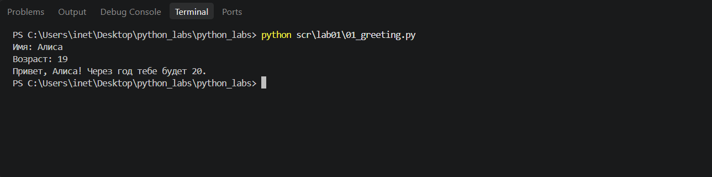
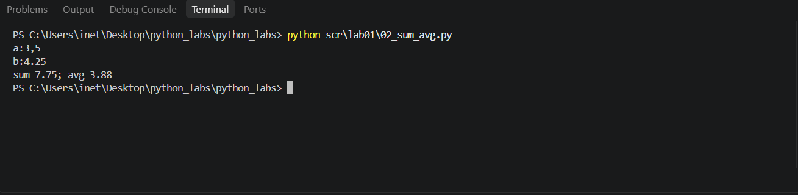
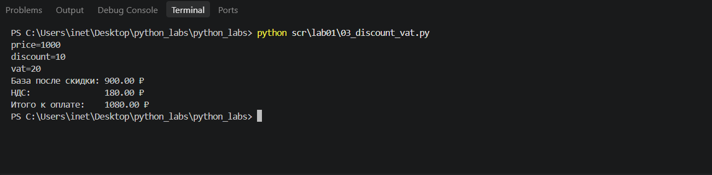
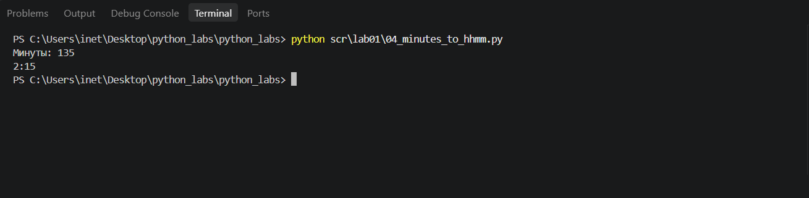
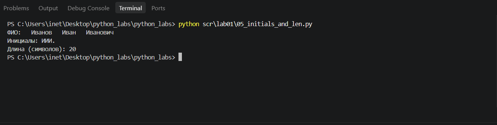

# python_labs
# Лабораторная работа 1

# # Задание 1
На ввод получила имя и возраст, вывела введенные данные в необходимом шаблоне.

# # Задание 2
Получила на ввод 2 вещественных числа, в каждом input прописала replace для замены ',' на '.', чтобы при вводе программа одинаково считывала оба разделителя.
Прописала переменные суммы и среднего арифметического.
Вывела данные в необходимом формате.

# # Задание 3
Получила на ввод price(цену), discount(размер скидки) и vat(НДС).
По формулам из ТЗ посчитала Базу после скидки, НДС и Итого.
Вывела данные в необходимом формате.

# # Задание 4
Получила на ввод минуты, в отдельную переменную(h от англ. hours) посчитала количество целых часов через '//'(целочисленное деление), в переменную min(от англ. minutes) посчитала количество оставшихся минут через '%'(остаток от деления на число).
Вывела данные в необходимом формате.

# # Задание 5
Получила на ввод полное ФИО.
Очистила его от лишних пробелов, записала списком(.split()), склеила в строку(.join()) в cleaned_name(очищенное имя), в итоге получилась строка с ФИО, разделенным одиночными пробелами.
В words(слова) взяла cleaned_name и разбила в список слов(чтобы отдельно лежали фамилия, имя, отчество).
Создала пустую строку initials(инициалы), для записи будущих значений. 
Циклом for  in : перебрала каждое слово списка words по отдельности, беря первый символ по индексу(word[0]) и переводя его в верхний регистр. Добавляла каждый полученный символ к строке initials.
После цикла добавила к строке '.' для соблюдения формата при выводе.
Вывела данные в необходимом формате.
