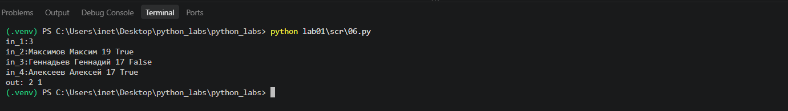

# python_labs
# Лабораторная работа 1

# # Задание 1
На ввод получила имя и возраст, вывела введенные данные в необходимом шаблоне.

# # Задание 2
Получила на ввод 2 вещественных числа, в каждом input прописала replace для замены ',' на '.', чтобы при вводе программа одинаково считывала оба разделителя.  

Прописала переменные суммы и среднего арифметического.  

Вывела данные в необходимом формате.

# # Задание 3
Получила на ввод price(цену), discount(размер скидки) и vat(НДС).  

По формулам из ТЗ посчитала Базу после скидки, НДС и Итого.  

Вывела данные в необходимом формате.

# # Задание 4
Получила на ввод минуты, в отдельную переменную(h от англ. hours) посчитала количество целых часов через '//'(целочисленное деление), в переменную min(от англ. minutes) посчитала количество оставшихся минут через '%'(остаток от деления на число).  

Вывела данные в необходимом формате.

# # Задание 5
Получила на ввод полное ФИО.  

Очистила его от лишних пробелов, записала списком(.split()), склеила в строку(.join()) в cleaned_name(очищенное имя), в итоге получилась строка с ФИО, разделенным одиночными пробелами.  

В words(слова) взяла cleaned_name и разбила в список слов(чтобы отдельно лежали фамилия, имя, отчество).  

Создала пустую строку initials(инициалы), для записи будущих значений.  

Циклом 'for  in :' перебрала каждое слово списка words по отдельности, беря первый символ по индексу(word[0]) и переводя его в верхний регистр. Добавляла каждый полученный символ к строке initials. 

После цикла добавила к строке '.' для соблюдения формата при выводе.  

Вывела данные в необходимом формате.

# Задания со звездочкой
# # Задание 6*
Получила на ввод количество строк с данными. 
Записала всё в n.

Добавила счетчики для очного(count_true) и заочного(count_false) участия(обучения).

Циклом 'for i in range():' собрала заданное в n количество строк с данными, записала списком через split() в переменную line.

Через if-else прогнала счетчики на очно-заочное.

Вывела данные в необходимом формате.

# # Задание 7*
На ввод получаю строку, состоящую из различных символов без пробелов. Сохраняю ее в input_str(в названии переменной указано, что она получена со входа - input, формат данных - str). 

Создаю функцию для поиска первой заглавной буквы -> decrypt_string(дословно - расшифровать_строка), с параметром s, куда будет записана строка переданная при вызове(input_str). 
Задаю начальный индекс(start_idx) со значением -1, пока мы не найдем нужную букву, позже ее индекс будет записан сюда вместо -1. 
Запускаю цикл 'for i in' при помощи enumerate() преобразую строку s в список пар формата (индекс, символ). Цикл перебирает эти пары, i - индекс, char - буква.  
Добавляю if, который через '.isupper()' находит заглавные буквы и выводит True/False. 
Если выводится True, записываю этот индекс в start_idx. 
Так как нас интересует только первая заглавная буква, ставлю в конце break, чтобы после первого найденного программа больше не искала.

Через еще один if проверяю на ошибку: отсутсвие в строке заглавных букв вообще.  
Если start_idx остался равен -1 (не перезаписался на какой-либо индекс), программа вернет пустую строку('') и прекратит работу.

По условию символы оригинальной строки расположены в фиксированном шаге друг от друга и второй символ стоит сразу после цифры. 
Создаю переменную step(шаг) равную 0, для последующей записи в нее измеренного шага. 
Через цикл 'for i in' снова перебираю строку, как было описано выше. 
Запускаю if и через метод '.isdigit()' нахожу первую цифру после найденной заглавной буквы.  
